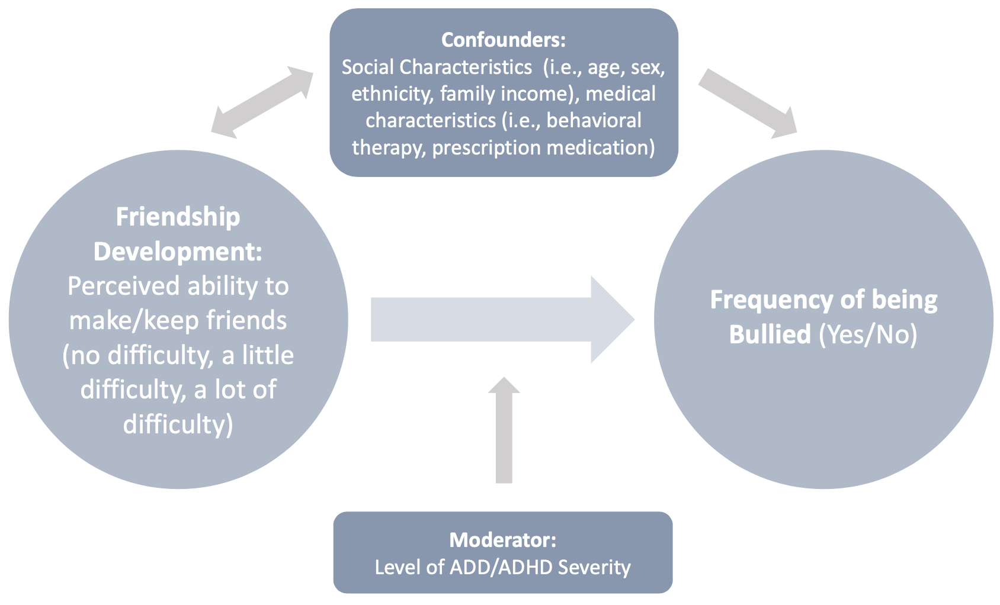

# NSCH Project: Repeated Cross-Sectional Study 

This project analyzes data collected by the National Survey of Children’s Health (NSCH) to determine the association between friendship development (FD) and bullying victimization (BV) amoung youth aged 12-17 years of age diagnosed with Attention deficit hyperactivity disorder (ADHD) within the United States. Association between FD and BV will be compared through the years 2018-2023 in order to determine the potential impacts of COVID-19 [i.e., pre(2018,2019), peak (2020,2021), and post-COVID (2022,2023)]. The association between FD and BV will be further examined after controlling for
potential confounding variables including baseline outcome status, age, sex, family income, and neurobehavioral disorder management (i.e.,
behavioural therapy, medication). 

Original datasets are publically accessible and can be viewed from the Child and Adolescent Health Measurement Initiative (CAHMI) Data Resource Center (DRC) (https://www.childhealthdata.org/browse) or, downloaded immediately from the United States Census Bureau (https://www.census.gov/programs-surveys/nsch/data/datasets.2023.html#list-tab-491554181) . 

Approval of use for the DRC datasets was granted by the CAHMI Data Resource Center for Child and Adolescent Health. This project has also recieved Research and Ethics Board approval through the University of Waterloo (application #47462). All analyses are conducted in accordance with ethical guidelines and data use agreements. 
